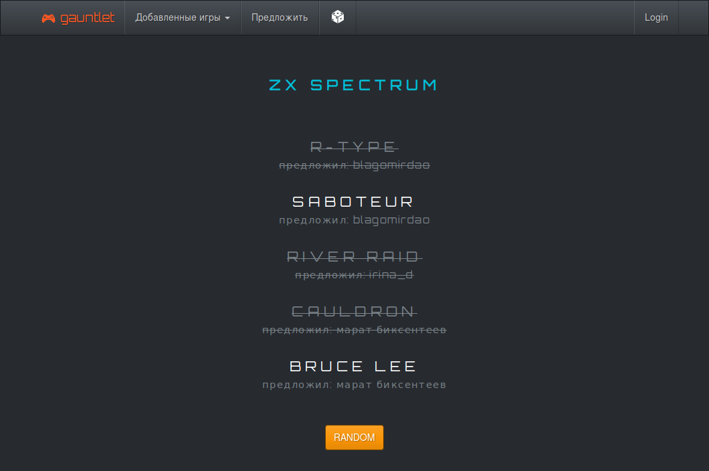
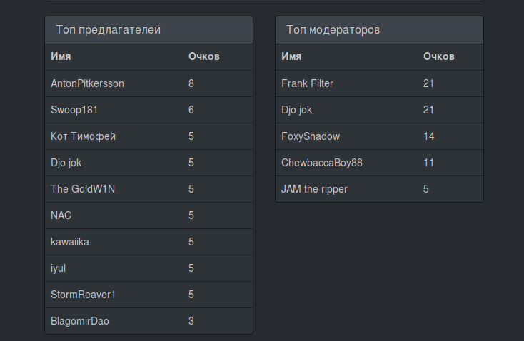
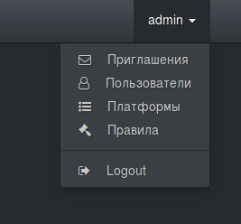
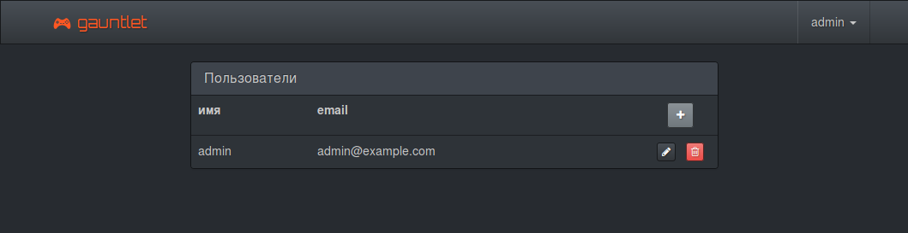
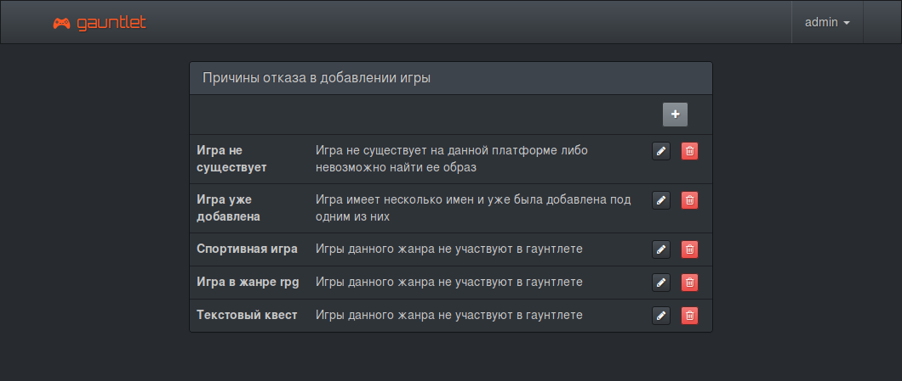
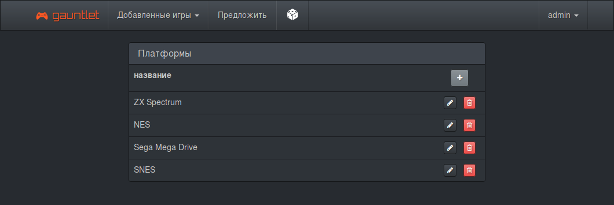
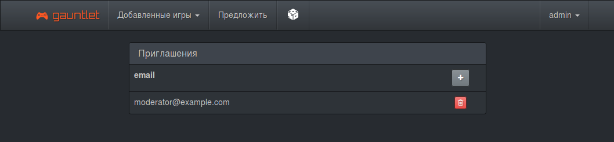
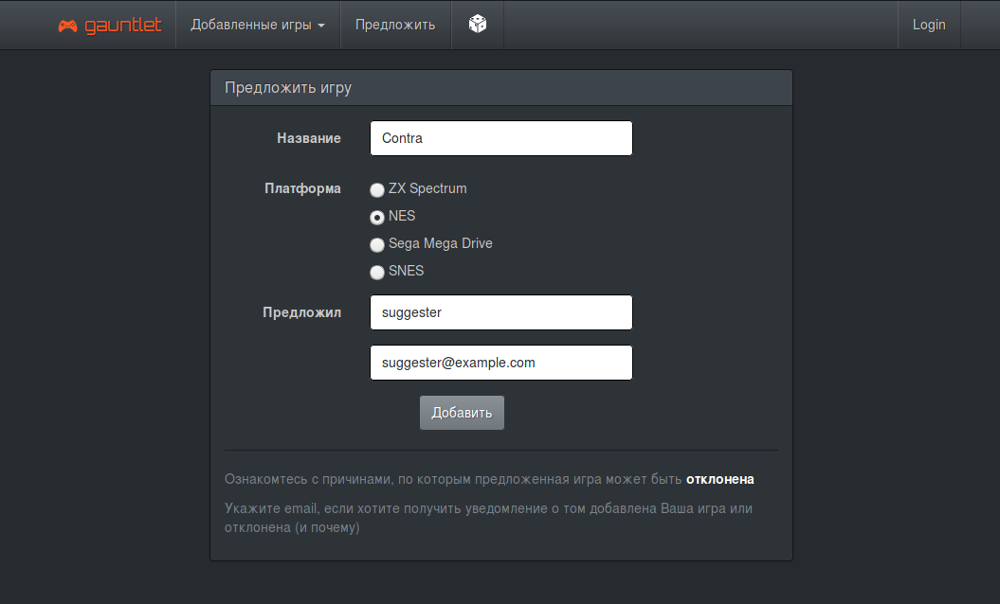
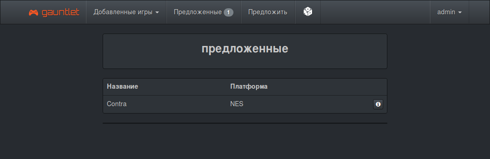
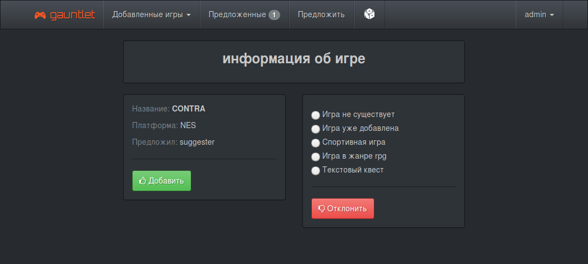

# Game Randomizer

Что это такое? Это рандомайзер для Retro Game Gauntlet или Roll Machine. Может быть полезен стримерам ретро игр. Существующие рандомайзеры уже содержат базу игр для каждой игровой платформы. Тут игр нет. Основная идея в том, что зрители каналов или сообщество сами добавляют игры, согласно заранее установленным правилам.

Есть 3 вида участников системы: администратор, модераторы, пользователи.
* Администратор задает правила, определяет список платформ, приглашает модераторов.
* Пользователь (регистрация не нужна) предлагает игру
* Модератор проверяет игру, согласно установленным правилам. После чего она доступна для выпадания в рандомайзере.

Игры выпадают так: сначала случайно выбирается 5 игр для указанной игровой платформы. Далее, после нажатия кнопки RANDOM из списка случайно вычеркивается игра и так до тех пор, пока в списке не останется только одна, которая и будет считаться выпавшей.

За добавление игр и за модерацию пользователям начисляются очки, которые отображают их вклад в данный гаунтлет.

## Установка

* Данное приложение написано с использованием фреймворка Laravel. Для найстройки типового окружения на хостинге можно использовать эту [инструкцию](https://www.digitalocean.com/community/tutorials/how-to-deploy-a-laravel-application-with-nginx-on-ubuntu-16-04). Для локальной установки можно использовать [данный](https://github.com/deeem/docker-environments/tree/laravel) docker-контейнер.
* Т.к. приложение рассылает письма, убедитесь, что в `.env` файле указаны параметры почтового сервера
* Создание ролей пользователей и добавление администратора выполняется командой `php artisan db:seed --class='DeploySeeder'`

## Начальная настройка

Панель администратора доступна после входа

### Учетная запись администратора

Система уже содержит учетную запись администратора, данные которой нужно изменить.
Для этого необходимо:
* войти с учетными данными: email `admin@example.com`, password `admin`
* перейти на страницу управления пользователями
* отредактировать учетную запись администратора, указав новые имя, пароль и почтовый адрес

### Добавить правила

Правила отказа в добавлении игры необходимы не только для того, чтобы проинформировать пользователя какие игры не будут добавлены, но и используются при обратной связи с пользователем добавившим данную игру. Пользователь получает уведомление по почте об удачном добавлении игры либо причине отказа.

### Добавить платформы

Список платформ, в которую пользователи смогут добавлять игры.

### Добавить модераторов

Добавить модераторов можно двумя способами:
* В меню "Пользователи" добавить нового пользователя. Все пользователи добавляемые таким способом являются модераторами. При таком способе нужно будет указать его имя, пароль и адрес почты вручную и потом передать модератору. Что не всегда удобно и небезопасно. Лучше отправить приглашение.
* Отправить приглашение. В меню "Приглашения" создать новое указав его почту. После получения письма новый модератор перейдет по предложенной ссылке, где ему будет предложено сменить имя и пароль. Пароль менять обязательно.

На этом начальная настройка завершена.

## Добавление игр

Пользователь после нажатия "Предложить" заполняет форму. 

После чего игра попадает в список "Предложенные"

Модератор или администратор могут ее добавить или отклонить, указав причину.

Пользователь, предложивший игру получит уведомление по почте, если он ее указал.
